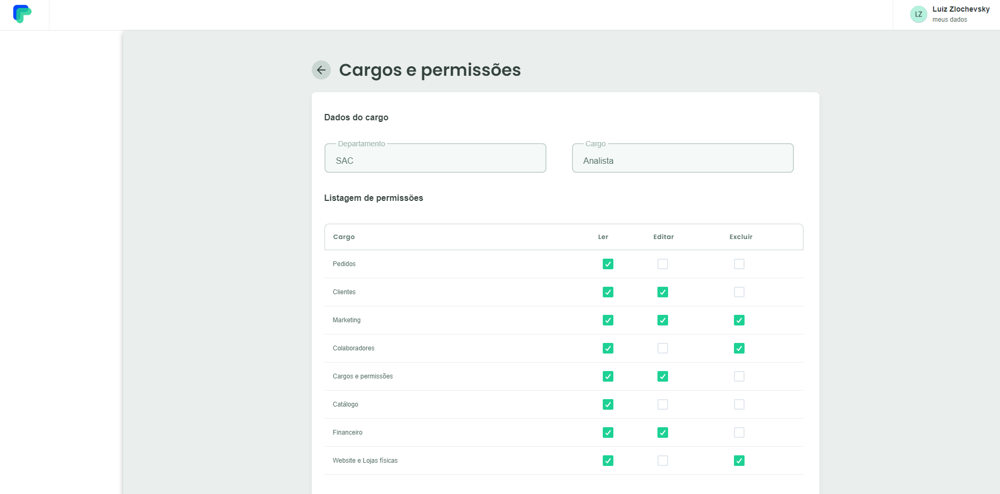

# Pedido Pago Challenge

## :computer: Sobre o Projeto

Desafio elaborado pela empresa Pedido Pago, onde consiste em consumir uma
API mockada pelo Pedido Pago e exibir os dados em telas, garantindo todas as funcionalidades proposto pelos requisitos.

<p align="center"><em>Confira o resultado do desafio em: <a href="https://pedido-pago-challenge-vitor.vercel.app" target="_blank">pedido-pago-challenge-vitor.vercel.app</a></em></p>

## Imagens

<div>
   
   
</div>

## :rocket: Techs

<ul>
  <li> Javascript </li>
  <li> ReactJS </li>
  <li> Next.js </li>
  <li> Typescript </li>
  <li> Emotion</li>
  <li> Axios </li>
  <li> React Icons </li>
  <li> Chakra UI </li>
</ul>

## Desenvolvimento

---

### Pré-requisitos

- Instalar [Node.js](https://nodejs.org)

- Instalar [Yarn](https://yarnpkg.com/)

### Clone o repositório

```bash
$ git clone https://github.com/vitorgaletti/pedido-pago-challenge.git
```

### Executar Projeto

```bash
# Mudar para directório
$ cd pedido-pago-challenge/
```

- Instalar dependências

```bash
$ yarn install
```

- Execute

```bash
$ yarn start
```

- Executar scripts

|           Ação            |  Utilização  |
| :-----------------------: | :----------: |
| Iniciar o desenvolvimento |  `yarn dev`  |
|  Compilar para produção   | `yarn build` |

## Autor

- [@vitorgaletti](https://github.com/vitorgaletti)
